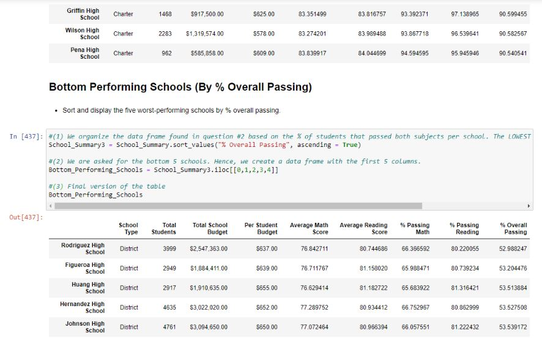

# Pandas Analysis (PyCitySchools)

In this project, I have analyzed a dataset with information about district-wide standardized test results. I have leveraged Pandas to aggregate data and showcase trends in school performance. My report includes the following: 

### District Summary

* High level snapshot (in table form) of the district's key metrics, including:
  * Total Schools
  * Total Students
  * Total Budget
  * Average Math Score
  * Average Reading Score
  * % Passing Math (The percentage of students that passed math.)
  * % Passing Reading (The percentage of students that passed reading.)
  * % Overall Passing (The percentage of students that passed math and reading.)

### School Summary

* Overview table that summarizes key metrics about each school, including:
  * School Name
  * School Type
  * Total Students
  * Total School Budget
  * Per Student Budget
  * Average Math Score
  * Average Reading Score
  * % Passing Math (The percentage of students that passed math.)
  * % Passing Reading (The percentage of students that passed reading.)
  * % Overall Passing (The percentage of students that passed math and reading.)

### Top Performing Schools (By % Overall Passing)

* Table that highlights the top 5 performing schools based on % Overall Passing, including:
  * School Name
  * School Type
  * Total Students
  * Total School Budget
  * Per Student Budget
  * Average Math Score
  * Average Reading Score
  * % Passing Math (The percentage of students that passed math.)
  * % Passing Reading (The percentage of students that passed reading.)
  * % Overall Passing (The percentage of students that passed math and reading.)

### Bottom Performing Schools (By % Overall Passing)

* Table that highlights the bottom 5 performing schools based on % Overall Passing, including all of the same metrics as above.

### Math Scores by Grade

* Table that lists the average Math Score for students of each grade level (9th, 10th, 11th, 12th) at each school.

### Reading Scores by Grade

* Table that lists the average Reading Score for students of each grade level (9th, 10th, 11th, 12th) at each school.

### Scores by School Spending

* Table that breaks down school performances based on average Spending Ranges (Per Student). 4 bins have been used to group school spending. The table includes the following:
  * Average Math Score
  * Average Reading Score
  * % Passing Math (The percentage of students that passed math.)
  * % Passing Reading (The percentage of students that passed reading.)
  * % Overall Passing (The percentage of students that passed math and reading.)

### Scores by School Size

* Similar breakdown as above, but this time schools are grouped based on a reasonable approximation of school size (Small, Medium, Large).

### Scores by School Type

* Similar breakdown as above, but this time schools are grouped based on school type (Charter vs. District).

### Tools utilized: 

* Pandas libary
* Jupyter Notebook

-------

Contact: jorge.arriola.villafuerte@gmail.com
